# Guardian Production V1 Requirement Dependency Graph

Generated from `docs/requirements/requirements.yaml`.
Normative source: `docs/spec/guardian-production-v1.md`.

Only valid `GRD-*` and `AT-*` dependency edges are rendered. Structured ambiguities are intentionally excluded from graph nodes.

```mermaid
flowchart LR
  AT_ACT_001["AT-ACT-001"]
  AT_AST_001["AT-AST-001"]
  AT_CLS_001["AT-CLS-001"]
  AT_CLS_002["AT-CLS-002"]
  AT_CON_001["AT-CON-001"]
  AT_DRIFT_001["AT-DRIFT-001"]
  AT_ID_001["AT-ID-001"]
  AT_INF_001["AT-INF-001"]
  AT_INF_002["AT-INF-002"]
  AT_MLO_001["AT-MLO-001"]
  AT_OPA_001["AT-OPA-001"]
  AT_OUT_001["AT-OUT-001"]
  AT_POL_001["AT-POL-001"]
  AT_QC_001["AT-QC-001"]
  AT_QC_002["AT-QC-002"]
  AT_REA_001["AT-REA-001"]
  AT_REA_002["AT-REA-002"]
  AT_REA_003["AT-REA-003"]
  AT_REC_001["AT-REC-001"]
  AT_RPL_001["AT-RPL-001"]
  AT_RPL_002["AT-RPL-002"]
  AT_SCL_001["AT-SCL-001"]
  AT_SCL_002["AT-SCL-002"]
  AT_TEN_001["AT-TEN-001"]
  AT_TLS_001["AT-TLS-001"]
  AT_TOP_001["AT-TOP-001"]
  AT_TTL_001["AT-TTL-001"]
  AT_WF_001["AT-WF-001"]
  GRD_ACT_001["GRD-ACT-001"]
  GRD_ACT_002["GRD-ACT-002"]
  GRD_AST_001["GRD-AST-001"]
  GRD_AST_002["GRD-AST-002"]
  GRD_AST_003["GRD-AST-003"]
  GRD_AST_004["GRD-AST-004"]
  GRD_AST_005["GRD-AST-005"]
  GRD_CLS_001["GRD-CLS-001"]
  GRD_CLS_002["GRD-CLS-002"]
  GRD_CLS_003["GRD-CLS-003"]
  GRD_CLS_004["GRD-CLS-004"]
  GRD_CLS_006["GRD-CLS-006"]
  GRD_CON_001["GRD-CON-001"]
  GRD_CON_002["GRD-CON-002"]
  GRD_CON_003["GRD-CON-003"]
  GRD_CON_004["GRD-CON-004"]
  GRD_CON_005["GRD-CON-005"]
  GRD_DRIFT_001["GRD-DRIFT-001"]
  GRD_DRIFT_002["GRD-DRIFT-002"]
  GRD_DRIFT_003["GRD-DRIFT-003"]
  GRD_DRIFT_004["GRD-DRIFT-004"]
  GRD_ID_001["GRD-ID-001"]
  GRD_ID_002["GRD-ID-002"]
  GRD_ID_003["GRD-ID-003"]
  GRD_INF_002["GRD-INF-002"]
  GRD_INF_003["GRD-INF-003"]
  GRD_INF_004["GRD-INF-004"]
  GRD_INF_005["GRD-INF-005"]
  GRD_INF_006["GRD-INF-006"]
  GRD_MLO_001["GRD-MLO-001"]
  GRD_MLO_002["GRD-MLO-002"]
  GRD_MLO_004["GRD-MLO-004"]
  GRD_MLO_005["GRD-MLO-005"]
  GRD_MLO_006["GRD-MLO-006"]
  GRD_MLO_007["GRD-MLO-007"]
  GRD_OPA_001["GRD-OPA-001"]
  GRD_OPA_002["GRD-OPA-002"]
  GRD_OPA_003["GRD-OPA-003"]
  GRD_OPA_004["GRD-OPA-004"]
  GRD_OPA_005["GRD-OPA-005"]
  GRD_OPA_006["GRD-OPA-006"]
  GRD_OPA_007["GRD-OPA-007"]
  GRD_OUT_001["GRD-OUT-001"]
  GRD_OUT_002["GRD-OUT-002"]
  GRD_OUT_003["GRD-OUT-003"]
  GRD_OUT_004["GRD-OUT-004"]
  GRD_OUT_005["GRD-OUT-005"]
  GRD_OUT_006["GRD-OUT-006"]
  GRD_OUT_007["GRD-OUT-007"]
  GRD_POL_001["GRD-POL-001"]
  GRD_POL_002["GRD-POL-002"]
  GRD_POL_003["GRD-POL-003"]
  GRD_POL_004["GRD-POL-004"]
  GRD_QC_004["GRD-QC-004"]
  GRD_QC_005["GRD-QC-005"]
  GRD_QC_007["GRD-QC-007"]
  GRD_REA_002["GRD-REA-002"]
  GRD_REA_003["GRD-REA-003"]
  GRD_REA_004["GRD-REA-004"]
  GRD_REA_005["GRD-REA-005"]
  GRD_REA_006["GRD-REA-006"]
  GRD_REC_001["GRD-REC-001"]
  GRD_REC_002["GRD-REC-002"]
  GRD_REC_003["GRD-REC-003"]
  GRD_REC_004["GRD-REC-004"]
  GRD_RPL_001["GRD-RPL-001"]
  GRD_SCL_001["GRD-SCL-001"]
  GRD_SCL_002["GRD-SCL-002"]
  GRD_SCL_005["GRD-SCL-005"]
  GRD_SCL_006["GRD-SCL-006"]
  GRD_SCL_007["GRD-SCL-007"]
  GRD_TEN_001["GRD-TEN-001"]
  GRD_TEN_002["GRD-TEN-002"]
  GRD_TEN_003["GRD-TEN-003"]
  GRD_TEN_004["GRD-TEN-004"]
  GRD_TEN_005["GRD-TEN-005"]
  GRD_TEN_006["GRD-TEN-006"]
  GRD_TEN_007["GRD-TEN-007"]
  GRD_TEN_008["GRD-TEN-008"]
  GRD_TLS_001["GRD-TLS-001"]
  GRD_TLS_003["GRD-TLS-003"]
  GRD_TLS_004["GRD-TLS-004"]
  GRD_TOP_003["GRD-TOP-003"]
  GRD_TOP_006["GRD-TOP-006"]
  GRD_TTL_003["GRD-TTL-003"]
  GRD_TTL_005["GRD-TTL-005"]
  GRD_TTL_006["GRD-TTL-006"]
  GRD_WF_001["GRD-WF-001"]
  GRD_ACT_001 --> AT_ACT_001
  GRD_ACT_002 --> AT_ACT_001
  GRD_AST_001 --> AT_AST_001
  GRD_AST_002 --> AT_AST_001
  GRD_AST_003 --> AT_AST_001
  GRD_AST_004 --> AT_AST_001
  GRD_AST_005 --> AT_AST_001
  GRD_CLS_001 --> AT_CLS_001
  GRD_CLS_001 --> AT_CLS_002
  GRD_CLS_002 --> AT_CLS_001
  GRD_CLS_003 --> AT_CLS_001
  GRD_CLS_004 --> AT_CLS_002
  GRD_CLS_006 --> AT_CLS_002
  GRD_CON_001 --> AT_CON_001
  GRD_CON_002 --> AT_CON_001
  GRD_CON_003 --> AT_CON_001
  GRD_CON_004 --> AT_CON_001
  GRD_CON_005 --> AT_CON_001
  GRD_DRIFT_001 --> AT_DRIFT_001
  GRD_DRIFT_002 --> AT_DRIFT_001
  GRD_DRIFT_003 --> AT_DRIFT_001
  GRD_DRIFT_004 --> AT_DRIFT_001
  GRD_ID_001 --> AT_ID_001
  GRD_ID_002 --> AT_ID_001
  GRD_ID_003 --> AT_ID_001
  GRD_INF_002 --> AT_INF_001
  GRD_INF_002 --> AT_INF_002
  GRD_INF_003 --> AT_INF_001
  GRD_INF_003 --> AT_INF_002
  GRD_INF_004 --> AT_INF_002
  GRD_INF_005 --> AT_INF_001
  GRD_INF_005 --> AT_INF_002
  GRD_INF_006 --> AT_INF_001
  GRD_MLO_001 --> AT_MLO_001
  GRD_MLO_002 --> AT_RPL_001
  GRD_MLO_004 --> AT_MLO_001
  GRD_MLO_005 --> AT_MLO_001
  GRD_MLO_006 --> AT_MLO_001
  GRD_MLO_007 --> AT_MLO_001
  GRD_OPA_001 --> AT_OPA_001
  GRD_OPA_002 --> AT_OPA_001
  GRD_OPA_003 --> AT_OPA_001
  GRD_OPA_004 --> AT_OPA_001
  GRD_OPA_005 --> AT_OPA_001
  GRD_OPA_006 --> AT_OPA_001
  GRD_OPA_007 --> AT_OPA_001
  GRD_OUT_001 --> AT_OUT_001
  GRD_OUT_002 --> AT_OUT_001
  GRD_OUT_003 --> AT_OUT_001
  GRD_OUT_004 --> AT_OUT_001
  GRD_OUT_005 --> AT_OUT_001
  GRD_OUT_006 --> AT_OUT_001
  GRD_OUT_007 --> AT_OUT_001
  GRD_POL_001 --> AT_POL_001
  GRD_POL_002 --> AT_POL_001
  GRD_POL_003 --> AT_POL_001
  GRD_POL_004 --> AT_POL_001
  GRD_QC_004 --> AT_QC_001
  GRD_QC_005 --> AT_QC_001
  GRD_QC_007 --> AT_QC_002
  GRD_REA_002 --> AT_REA_001
  GRD_REA_003 --> AT_REA_001
  GRD_REA_004 --> AT_REA_002
  GRD_REA_005 --> AT_REA_001
  GRD_REA_005 --> AT_REA_002
  GRD_REA_006 --> AT_REA_003
  GRD_REC_001 --> AT_REC_001
  GRD_REC_002 --> AT_REC_001
  GRD_REC_003 --> AT_REC_001
  GRD_REC_004 --> AT_REC_001
  GRD_RPL_001 --> AT_RPL_002
  GRD_SCL_001 --> AT_SCL_001
  GRD_SCL_002 --> AT_SCL_001
  GRD_SCL_005 --> AT_SCL_001
  GRD_SCL_006 --> AT_SCL_002
  GRD_SCL_007 --> AT_SCL_001
  GRD_TEN_001 --> AT_TEN_001
  GRD_TEN_002 --> AT_TEN_001
  GRD_TEN_003 --> AT_TEN_001
  GRD_TEN_004 --> AT_TEN_001
  GRD_TEN_005 --> AT_TEN_001
  GRD_TEN_006 --> AT_TEN_001
  GRD_TEN_007 --> AT_TEN_001
  GRD_TEN_008 --> AT_TEN_001
  GRD_TLS_001 --> AT_TLS_001
  GRD_TLS_003 --> AT_TLS_001
  GRD_TLS_004 --> AT_TLS_001
  GRD_TOP_003 --> AT_TOP_001
  GRD_TOP_006 --> AT_TOP_001
  GRD_TTL_003 --> AT_TTL_001
  GRD_TTL_005 --> AT_TTL_001
  GRD_TTL_006 --> AT_TTL_001
  GRD_WF_001 --> AT_WF_001
```

| Dependency | Dependent |
| --- | --- |
| `GRD-ACT-001` | `AT-ACT-001` |
| `GRD-ACT-002` | `AT-ACT-001` |
| `GRD-AST-001` | `AT-AST-001` |
| `GRD-AST-002` | `AT-AST-001` |
| `GRD-AST-003` | `AT-AST-001` |
| `GRD-AST-004` | `AT-AST-001` |
| `GRD-AST-005` | `AT-AST-001` |
| `GRD-CLS-001` | `AT-CLS-001` |
| `GRD-CLS-001` | `AT-CLS-002` |
| `GRD-CLS-002` | `AT-CLS-001` |
| `GRD-CLS-003` | `AT-CLS-001` |
| `GRD-CLS-004` | `AT-CLS-002` |
| `GRD-CLS-006` | `AT-CLS-002` |
| `GRD-CON-001` | `AT-CON-001` |
| `GRD-CON-002` | `AT-CON-001` |
| `GRD-CON-003` | `AT-CON-001` |
| `GRD-CON-004` | `AT-CON-001` |
| `GRD-CON-005` | `AT-CON-001` |
| `GRD-DRIFT-001` | `AT-DRIFT-001` |
| `GRD-DRIFT-002` | `AT-DRIFT-001` |
| `GRD-DRIFT-003` | `AT-DRIFT-001` |
| `GRD-DRIFT-004` | `AT-DRIFT-001` |
| `GRD-ID-001` | `AT-ID-001` |
| `GRD-ID-002` | `AT-ID-001` |
| `GRD-ID-003` | `AT-ID-001` |
| `GRD-INF-002` | `AT-INF-001` |
| `GRD-INF-002` | `AT-INF-002` |
| `GRD-INF-003` | `AT-INF-001` |
| `GRD-INF-003` | `AT-INF-002` |
| `GRD-INF-004` | `AT-INF-002` |
| `GRD-INF-005` | `AT-INF-001` |
| `GRD-INF-005` | `AT-INF-002` |
| `GRD-INF-006` | `AT-INF-001` |
| `GRD-MLO-001` | `AT-MLO-001` |
| `GRD-MLO-002` | `AT-RPL-001` |
| `GRD-MLO-004` | `AT-MLO-001` |
| `GRD-MLO-005` | `AT-MLO-001` |
| `GRD-MLO-006` | `AT-MLO-001` |
| `GRD-MLO-007` | `AT-MLO-001` |
| `GRD-OPA-001` | `AT-OPA-001` |
| `GRD-OPA-002` | `AT-OPA-001` |
| `GRD-OPA-003` | `AT-OPA-001` |
| `GRD-OPA-004` | `AT-OPA-001` |
| `GRD-OPA-005` | `AT-OPA-001` |
| `GRD-OPA-006` | `AT-OPA-001` |
| `GRD-OPA-007` | `AT-OPA-001` |
| `GRD-OUT-001` | `AT-OUT-001` |
| `GRD-OUT-002` | `AT-OUT-001` |
| `GRD-OUT-003` | `AT-OUT-001` |
| `GRD-OUT-004` | `AT-OUT-001` |
| `GRD-OUT-005` | `AT-OUT-001` |
| `GRD-OUT-006` | `AT-OUT-001` |
| `GRD-OUT-007` | `AT-OUT-001` |
| `GRD-POL-001` | `AT-POL-001` |
| `GRD-POL-002` | `AT-POL-001` |
| `GRD-POL-003` | `AT-POL-001` |
| `GRD-POL-004` | `AT-POL-001` |
| `GRD-QC-004` | `AT-QC-001` |
| `GRD-QC-005` | `AT-QC-001` |
| `GRD-QC-007` | `AT-QC-002` |
| `GRD-REA-002` | `AT-REA-001` |
| `GRD-REA-003` | `AT-REA-001` |
| `GRD-REA-004` | `AT-REA-002` |
| `GRD-REA-005` | `AT-REA-001` |
| `GRD-REA-005` | `AT-REA-002` |
| `GRD-REA-006` | `AT-REA-003` |
| `GRD-REC-001` | `AT-REC-001` |
| `GRD-REC-002` | `AT-REC-001` |
| `GRD-REC-003` | `AT-REC-001` |
| `GRD-REC-004` | `AT-REC-001` |
| `GRD-RPL-001` | `AT-RPL-002` |
| `GRD-SCL-001` | `AT-SCL-001` |
| `GRD-SCL-002` | `AT-SCL-001` |
| `GRD-SCL-005` | `AT-SCL-001` |
| `GRD-SCL-006` | `AT-SCL-002` |
| `GRD-SCL-007` | `AT-SCL-001` |
| `GRD-TEN-001` | `AT-TEN-001` |
| `GRD-TEN-002` | `AT-TEN-001` |
| `GRD-TEN-003` | `AT-TEN-001` |
| `GRD-TEN-004` | `AT-TEN-001` |
| `GRD-TEN-005` | `AT-TEN-001` |
| `GRD-TEN-006` | `AT-TEN-001` |
| `GRD-TEN-007` | `AT-TEN-001` |
| `GRD-TEN-008` | `AT-TEN-001` |
| `GRD-TLS-001` | `AT-TLS-001` |
| `GRD-TLS-003` | `AT-TLS-001` |
| `GRD-TLS-004` | `AT-TLS-001` |
| `GRD-TOP-003` | `AT-TOP-001` |
| `GRD-TOP-006` | `AT-TOP-001` |
| `GRD-TTL-003` | `AT-TTL-001` |
| `GRD-TTL-005` | `AT-TTL-001` |
| `GRD-TTL-006` | `AT-TTL-001` |
| `GRD-WF-001` | `AT-WF-001` |

This file is generated. Run `task requirements:render`; do not edit it independently.
